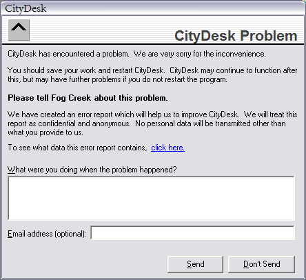
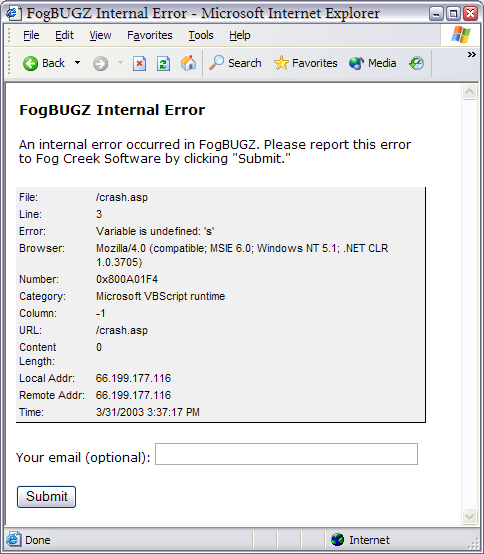

Joel on Software

>#Get Crash Reports from Your Users - Automatically

#从用户处自动获得崩溃报告

>######by Joel Spolsky Monday, April  18th, 2003

---
>I used to work as a developer on the client software for one of the largest American ISPs. Our software was used by literally millions of people. Even the rarest bug had the potential to affect hundreds or thousands of users. Yet I felt extremely confident when we decided to push the button releasing our latest code. I remember telling my dad, "The beta is looking great; yesterday we only had twelve crashes in all of North America."

我曾经为美国的最大的ISP服务商工作两年，工作内容是开发客户端软件。我们软件的真实用户有数百万人。 哪怕是最罕见的错误都有可能影响成百上千人。 然而当我们决定按下发布最新版按钮的时候仍然感到十分自信。我记得这样告诉我爹，“Beta版本看起来相当不错；昨天即使全美我们也只有12个崩溃事件”。

>Twelve, huh? Not, say, thirteen?

>Nope. Twelve. We were using an increasingly popular technique of collecting crash reports from the field automatically, and summarizing them in our bug tracking database, allowing developers to find and fix bugs that only happened in the field. These were usually the kinds of bugs we would never have caught in the test lab, since we couldn't possibly reproduce every bizarre PC configuration our customers might have.

12个？难道不是13个么？

不，就12个。 我们使用了越来越流行的技术来自动搜集行内崩溃报告， 然后在我们的错误追踪数据库里归纳这些错误， 这样使得开发人员能够搜集和修复发生在特定行内的错误。 这些通常是我们在测试实验室里永远无法捕捉到的错误， 因为我们没办法来还原我们客户可能有的各种各样的PC配置。

>This crash detection and reporting is starting to become more common. Now that Internet Explorer and Windows XP have it built-in, customers are starting to expect their desktop software to take care of reporting its own crashes.

这种崩溃追踪已经开始越来越普通了，现在IE和WindowsXP都内置了这项功能， 客户开始期望他们的桌面软件能够自动处理和报告它们的崩溃事件。

>The confidence you get from finding out about every crash, anywhere in the world, is crucial to delivering a high quality product that needs to be used in the wild. For those of us in the consumer software business it's absolutely critical. You can't rely on your customers to tell you about crashes—many of them may not be technical enough, and most of them won't bother to take time off of their own important work to give you a useful crash report unless you make it completely automatic.

能够找到在世界任何地方发生的崩溃事件无疑让你获得信心，这种信心对于开发高质量广泛使用的产品来说至关重要。 对于我们从事消费软件开发的人员更是绝对重要。 你不可能指望你的客户来向你报告崩溃事件 – 他们中的大部分人不够技术，大部分的人也不愿意花费自己工作的宝贵时间来给你写个有用的崩溃报告，所以这件事只能是完全自动化进行。

>Now that I have my own company, I'm a big believer in this technique. Virtually all the code we write at Fog Creek Software has some way of reporting errors back to the development team via our FogBugz bug tracking database. That includes code that we ship to customers, such as CityDesk, a Windows application, and FogBugz itself, which is a web-based application that our customers install on their own web servers. Both of them report crashes via the Internet. Even software that we write for internal use only, such as the e-commerce software that runs the Fog Creek online store, notifies the development team if a crash occurs.

现在我创立了自己的公司，我是这种技术一大信徒。 几乎我们在FogCreek软件公司编写的代码都有这种向开发团队错误追踪数据库反馈错误的机制。 包含了我们卖给客户的代码，例如windows桌面程序CityDesk，还有FogBugz本身，这是基于网页的应用程序，客户需要安装在他们自己的服务器上。 他们都通过因特网来报告崩溃事件。 甚至是我们写的内部使用的软件，例如运行FogCreek在线商店的e电商软件，如果出现崩溃事件的话也会通知开发团队。

>##Anatomy of a Crash 

##分析一次崩溃事件

>OK, so your code crashed. In almost every programming environment, there's some way to recover from the crash at a central location.  At this point, instead of letting the program die, we display a dialog box (see Figure 1).

好吧，既然你的代码崩溃了。几乎在任意一种编程环境里，都会有一个从崩溃中恢复的中心。 到这里我们会显示一个对话框（如图1）而不是让程序消亡。


>Figure 1: Our automated crash reporting dialog box is short and to the point.

图1：我们的自动崩溃报告对话框小巧而精悍

>One thing I've learned over the years is that the more questions you ask people, the less likely they are to answer. So we only ask the bare minimum number of questions that we think will help us diagnose the problem. What were you doing? What is your email address? We emphasize that providing an email address is optional, to alleviate privacy concerns. It's amazing what superstitions persist: in the consumer marketplace, there are lots of people who have been taught by the 11 o'clock news never to give out their email address, to avoid spam, and if you require an email address some percentage of these people just won't send in the report.

我这些年参透的另一个道理就是：你问别人越多的问题，他们就越不大可能回答你。 所以我们只会问最有助于我们诊断错误的问题。 你在做什么？ 你的email地址？ 我们强调提供email地址只是可选的，这样可以消除侵犯隐私的顾虑。 知道迷信仍然存在实在令人惊讶 ： 在消费者市场，有很多人会受11点新闻教育永远不要给出自己的email地址，从而避免垃圾邮件，如果你强制用户输入email地址，那么这其中一部分的人就不会发送这个报告。

>Almost any other information that you consider important can probably be obtained automatically, for example, what version of operating system they are using, how much RAM they have, etc.

>It's important to emphasize the anonymity and privacy of this crash submittal. People working on confidential data may not be willing to submit a crash report if they suspect we're about to upload all their sensitive work, so we provide a link that users can click on to see exactly what we're going to transmit. To avoid even the appearance of impropriety, be careful to tell people about any automatically gathered information that you're transmitting, too.

几乎所有你觉得重要的信息都能自动搜集到， 例如他们用的是什么操作系统， 有多大的内存，之类的。 

强调崩溃报告的匿名性和隐私非常重要。 工作涉及到保密的人如果觉得崩溃报告会反馈上传他的工作内容的时候就不会提交崩溃报告， 所以我们提供了一个链接，用户可以点击过去看看我们到底传输了些什么。 甚至为了避免看起来不恰当，要小心的告诉用户你们要传输的自动搜集的信息内容。

>##Collecting Data 

##搜集数据

>The next question is, what data should we collect that will help our developers find the crash? There is a temptation to grab everything. Every bit of system information you can find. The versions of every DLL and COM control on the user's system. Even a complete memory dump (a.k.a. core dump).

下一个问题就是，我们应该搜集什么样的数据以帮助开发人员定位这次崩溃？ 有一种倾向是搜集所有的信息。 所有你能找到的关于系统的信息。 用户系统的所有DLL和COM插件的信息。甚至是完整的内存映像（即内核转储）

>After several years working as a developer and never quite knowing what I'm supposed to do with core dumps, I have discovered that collecting this data is not, actually, necessary. Instead, here is the data we collect:

>  *	The exact version of our product

>  *	The OS version and the version of Internet Explorer. (So many parts of Windows are actually provided by Internet Explorer and its components that this is important even for GUI applications.)

>  *	The file and line number in the code where the crash occurred

>  *	The error message, as a string

>  *	A unique numeric code for this type of error

>  *	The user's description of what they were doing

>  *	The user's email address


做了几年开发人员却从没有搞清楚要如何处理内核转储，我觉得发现和搜集这个信息实际上并不必要。 相反我们会搜集以下数据：

  *	产品的确切版本

  *	操作系统版本和IE版本。(Windows很多部分是有IE实现的而且IE的组件对于哪怕是图形界面程序都是至关重要的)

  *	奔溃发生时候的文件行号

  *	错误信息，字符串

  *	这种错误类型的代码号

  *	用户关于正在进行的事项的描述

  *	用户的email地址

>That's it! Over the years we've found that knowing the exact line of code where the code crashed is enough information to fix almost any crash. For those rare cases where this isn't enough information, you can contact one of the users who experienced the crash via email and ask for any additional information that might help. The benefit of gathering so little information is that the crash reporting process is very fast, making users less impatient. Just checking the version numbers of all the DLLs and COM controls can take quite a while, especially when you factor in the upload time over modems, and very rarely provides useful information. Even if you discover that a certain crash only happens with a certain version of one of Microsoft's system DLLs, what are you going to do about it? You still have to fix the code to work around the crash.

就这些！这些年下来我们发现知道了崩溃发生的代码行号对于修复几乎所有的错误来说就已经足够了。 对于那些极端情况缺乏信息的， 你可以通过email联系遇到该崩溃的那个用户然后询问相关有用细节。 搜集这么少的信息的好处在于崩溃报告会变得非常快，不至于让用户觉得不耐烦。 仅仅检查用户所有的DLL和COM控件版本号就要花上好长时间， 特别是如果你算上拨号上网的上传时间，而这些东西几乎不会带来特别有用的信息。 哪怕你发现了这种特定的崩溃只有在微软系统的某个特定的DLL才有， 你又能做什么呢？ 你还是要修正你的代码来避免这种崩溃。

>##Phoning Home 

##打电话回家

>Thanks to the pervasiveness of the Internet, there's almost always one best way to send the information home: over the web. By sending a standard HTTP request, you will get your bug report past almost any kind of firewall customers may have in place. Virtually every programming environment now has built-in libraries to send an HTTP request and get the response back. For example, on Windows, there are built in functions in the WININET library that use Internet Explorer's network transport code to send an HTTP request and get the response. The best thing about these functions is that even if the user has configured his web browser to go through a proxy server, which is common inside firewalls, the WININET calls will automatically go through the proxy server, with no additional work on your part.

多亏了因特网的普及，总有一种最好的办法把信息送回家：通过网页。 通过发送一个标准的HTTP请求，你的错误报告就能穿过客户会安装的几乎所有的防火墙。 现在几乎所有的编程环境都提供了发送HTTP请求然后获得响应的库。 例如在Windows上，WINNET库里就有使用IE发送HTTTP请求获得响应的网络传输代码。 这些函数最好的地方是哪怕用户为他的浏览器配置了代理服务器（在防火墙内部很常见）WINNET调用也能自动的帮你穿越同样的代理服务器，而不需要你做任何额外的事情。

>For the response part of the HTTP request, our FogBugz server returns a super short XML file which indicates that the report was received, and includes a message which is displayed to the user. More about that in a moment.

而HTTP请求的响应部分，我们的FogBugz服务器会返回一段超级短的XML文件表示报告已经收到了，并包含一段显示给用户看的信息。马上就讨论更多细节。

>If your application is web based, there's something even easier you can do: display a web page containing a form that submits data to your server. It's as simple as changing the action attribute of the form tag to point to a URL on your bug tracking server. See Figure 2.

如果你的程序是基于网页的，那么你可以做一件更简单的事情：显示一个包含要提交的数据到你服务器的表单。 就跟修改表单的Action属性来指向你的错误跟踪服务器的URL一样。 如图2


>Figure 2: the web page that appears when FogBugz is about to crash. The HTML for this page contains a form which sends the complete crash report to a URL at Fog Creek Software that collects the crash data.
图2： 当FogBugz要崩溃的时候显示的网页.该HTML页面包含了一个发送完整崩溃报告到FogCreek软件崩溃数据收集中心的URL

>For certain types of applications, instead of sending the crash report right away, you may want to try writing it out to a file or the registry, and then sending it the next time the user launches the program. I call this technique delayed transmission. Although this will delay the report a bit, it has the advantage that if the crash was severe enough that the application is too messed up to transmit a bug report, you'll still get the report.

对于特定类型的程序，你可能要先把数据保存到文件或者注册表而不是马上发送崩溃报告，然后下次用户启动应用程序的时候再发送崩溃报告。 我把这种技术叫做延迟传输。 虽然这可能会延迟一点发送崩溃报告， 但是它的优点在于当程序崩溃如此严重乃至不能发送崩溃报告的时候，你仍然能最后得到崩溃报告。

>All crash reports arrive at Fog Creek via a single URL on our public-facing server. Our bug tracking database receives bug reports via this unique URL. In fact that URL is the only public access to our database; everything else is locked out, so people can submit bugs, but they can't get into the database.

所有崩溃报告都会通过一个我们公开的服务器URL发送到FogCreek。我们的错误跟踪数据库通过这个独特的URL获得错误报告。 实际上这个URL是访问我们数据库的唯一接口； 其他所有的东西都锁起来了，所以大家可以提交错误，但这些错误没法进入数据库。


>Figure 3: What a bug reported by BugzScout looks like in FogBugz. Note the BugzScout-specific fields "Scout Msg" and "Scout Will", shown highlighted.

图3： FogBugz收到的软件错误报告长什么样子.请注意BugzScout相关的字段 “ScoutMsg”和“ScoutWill”，高亮显示的那两个。

>Figure 3 shows what a bug looks like when it arrives in our database. We could have set it up so that the bug report automatically goes to a designated member of the development team, but these days rather than interrupting one person, we've set up a virtual person called "CityDesk New Bug." Every once in a while when we want to sift through crash reports, we can just search for all bugs assigned to this virtual person, and decide whether to fix them or not. The ones that we decide to fix are then assigned to a real person.

图3显示了当一个错误进入我们数据的时候是什么样子的。 我们本来可以这样设置，当一个错误进来的时候就会自动被分配到一个开发团队成员， 但现在我们设立了一个虚拟的任务叫做“CityDesk新错误”而不是打扰某一个人。 每隔一段时间当我们想筛选崩溃报告的时候，我们可以搜索分配给这个虚拟人物的崩溃报告， 然后决定是否修复这些错误。我们决定修复的错误就会被分配给真实的人。

>##Identifying Duplicate Crashes 

##区分出重复的奔溃事件

>An important aspect of automatic crash collection is that the same crash will probably happen many times to many people, and you don't really want a new bug in your database for every duplicate of the crash. We handle this by constructing a unique string that contains key elements of the crash data.

自动奔溃收集的一个重要方面就是同样的奔溃也许会在很多人身上发生，你不希望在数据库里对这种重复的崩溃搜集一个新的错误报告。 我们通过构建一个包含崩溃数据的关键字符串来处理这种重复情况。

>We are careful to construct this string in a way such that two people with the same crash generate the same string. After some experimentation, we found that the best way to do this is to include the error number, file name, function name, line number, and the version of our software in that string. In Figure 3, the unique string is "Error 91 (global:IsRoot:0) V1.0.32". That means error number 91 occurred in the file named global.bas, in the function IsRoot, on line 0, running version 1.0 of the software, build 32. Incidentally, we always use even build numbers for internal builds that we don't send out to customers, and odd build numbers for all builds that go to customers, so I can tell at a glance that this particular crash happened to a developer and not to a customer.

我们很小心的构造这种字符串，这样两个人遇到同样的崩溃的时候就会产生同样的字符串。 通过一些实验，我们发现处理的最好办法就是包含错误号，文件名，函数名，行号，然后是软件的版本号。 在图3中，该唯一字符床就是“Error 91 (global:IsRoot:0) V1.0.32”。意思是 在文件名为global.bas文件中出现的91号错误，该错误位于IsRoot函数，在第0行，当时正运行着软件的1.0版本低32个构建。顺便说下：我们使用偶数构建号作为内部构建，这种构建不会分发给用户， 而奇数号的所有构建会分发给客户，所以我一下子就能看出来这个崩溃发生在一个开发者身上而不是客户身上。

>FogBugz will automatically append future crashes with the same unique string to this case, rather than opening a new case. This helps the programmer see all the duplicates of the same crash in one place.

FogBugz会把新的崩溃追加到现有的相同特征字符崩溃记录上，而不是新开一个错误。 这就使程序员能够在同一个地方查看某个相同奔溃的所有重复版本。

>Designing the format of the unique string can be tricky. In the past, we included the entire text of the crash error message in this string. However, we soon discovered that the error message was translated into different languages. So for every crash report, we would find out about it separately in English, German, Spanish, French, and a few other languages I can't identify! We solved that problem by putting the error message in the body of the crash report but only putting the unique error number in the title, which doesn't vary from language to language, so we get far fewer dupes.

设计这种独特特征字符串的格式可能很难。 过去， 我们通常会把处所的所有错误信息字符都包含在这个字符串里。 但是我们很快发现错误信息会被翻译成各种语言。 所以同一个崩溃报告我们通常会有英语版本，德语版本，西班牙语版本，法语以及一些我无法辨识的语言！ 我们通过把这段字符嵌入到错误消息中间而在标题中只用错误号， 错误号不会随语言而改变，因此我们的崩溃报告重复率大大降低。

>We also set up the title in such a way that it can be easily searched for particular problems. Since we use the format filename:function:lineNumber (note the colons) in the title, it's easy to search for bugs in a particular function just by searching for ":function:". We prepend the letter V to our version number for the same reason; you can search for V1 or V1.0 or V1.0.32. If we had left out the V, a search for version 1 would yield every bug report that happened to have a 1 anywhere in the title.

我们同样通过一种特殊的方式来设定报告的标题，这样我们就可以轻松的搜索特定的问题报告。 我们采用的格式是 文件名：函数：行号（注意标题中的冒号）， 很容易就可以通过搜索“：函数名：”搜索在某个函数中出现的错误。 我们给版本号加上V前缀也是出于同样的考量； 你可以搜索V1或者V1.0或者V1.0.32如果我们省去V那么搜索版本1同样会导出所有其他标题中包含1的问题。

>Once the bug is identified, we can change a flag (Scout Will in the FogBugz interface) from "Continue Reporting" to "Stop Reporting" after which future crashes with the same unique string will just get ignored. We can even set a text message (Scout Msg in the FogBugz interface appears for automatically submitted cases) which will be sent back to all users in the future who have this crash. We use this to suggest workarounds when we've found them. Like, "Hey! Next time don't forget to pat your head and rub your tummy before you save!"

一旦错误被发现了，我们就能修改标志位（例如FogBugz接口中的ScoutWill字段）从“继续报告”到“停止报告”，这样未来的同样特征字符串的奔溃就会被直接忽略。 我们甚至可以设置一段字符信息（也就是自动提交例子里FogBugz的ScoutMsg字段）来送回给未来遇到同样崩溃的错误。 我们会用这个字段来向用户建议我们发现的零时解决方案。比如说“嘿！下次不要忘了先拍下头按摩下肚子然后再按保存键”。

>One common cause of duplicate reports is when a crash occurs in the crash handling code itself. This doesn't necessarily mean the crash handling code is buggy - it might just be because the original crash has scrambled something so badly that no code can run successfully any more.

造成重复崩溃报告的一个常见原因就是发生在崩溃处理代码里的崩溃。 这不是说崩溃处理代码本身有什么问题 – 可能就是崩溃已经造成了如此之大的破坏以至于没有代码能够成功运行。

>##Debugging 

##调试

>During beta testing periods, we try to look at each crash report right away. When the user provides their email address, developers can hit the Reply button in FogBugz to send them an email message on the spot if they need additional information. FogBugz automatically keeps a copy of all the correspondence related to this bug, incoming and outgoing, in the bug report itself.

在beta测试阶段，我们会尽量马上处理崩溃报告。 当用户提供他们的email地址的时候，开发者可以很轻松的点击Fogbugz里的“回复”按钮立刻给他们发送一封电子邮件，询问他们需要的额外的信息。 FogBugz会自动的保存这起事件的所有相关资料， 进来的和出去的，都存在错误报告里面。

>Once the product is shipping and developers are working on the next major release, they usually can't find time to look at every incoming crash report. Instead we tend to wait a few months to see what crashes are most common, and we only work on the crashes that occurred most often. The disadvantage is that you can't really correspond with a user asking questions about a crash they had several months ago: they just won't remember enough details. But I've found that if the same crash has happened several times, inevitably one of the users has given me enough clues about what they were doing that I can repro the bug in the lab. Indeed, it's very rare to know that a given line of code has crashed without having a good idea for what the problem might be, even if it's hard to figure out the repro case. Once I literally worked my way backwards through the code doing arithmetic and using applied logic to figure out repro steps. Hmm, if this is crashing, then this value must be negative. If it's negative, then this IF statement must have been true. And so on, until I figured out what combination of values led to the crash and realized what must have caused them.

当产品发布，开发者开始准备下一个大的发布的时候， 他们通常没有时间来处理新进来的所有崩溃。 通常我们会等一个月来分析最常见的崩溃是什么。 缺点是你没办法让用户几个月前提交的错误报告记起来。他们没办法记起那么多的细节来。 但我发现如果相同的崩溃发生很多次，总归会有用户会给出足够多的细节这样我就能够在测试实验中重现这个错误。 实际上，虽然很难搞清楚重现的错误，但如果不知道可能的问题是什么那么基本上更不可能知道哪行代码崩溃了。有一次，我几乎真的通过了应用逻辑逆向了代码的逻辑运算来搞清楚重现的错误案例。如果是伪阳性，那么这个IF语句就一定是成立的。注入此类，知道我发现了什么样的值组合能够导致崩溃，肯定就是这样的值组合造成的。

>##Triage 

##分门别类

>As soon as you build an automatic crash reporting system, you're going to get a pretty steady stream of crash reports. So good triage skills - deciding which bugs are most important to fix, and ignoring the others - are more important than usual.

一旦你建立的自动崩溃报告系统，你就会获得一个相当稳定的崩溃错误报告流。 所以好的分类技巧 – 决定哪些崩溃是重要的需要修复， 忽略其他的崩溃报告就比通常重要的多。

>CityDesk has about 20,000 copies in use and most of our customers tell us it's rock solid, but still we get a couple of crash reports every day, but many of them only happened once. When I investigated these, I usually discover various signs of bugs that we're probably never going to fix. For example:

  *	The user's computer is failing or has faulty RAM

  *	The user is experimenting by manually editing our files
  *	The user is running an old operating system like Windows 95 that is in the advanced stages of crashing
  *	The user is running our program under severe low memory conditions, possibly with a full disk and full memory

>CityDesk有大约两万份拷贝被投入使用，大部分的用户告诉我们它坚不可摧， 但我们每天还是会收到一两个崩溃报告， 但其中大多数都只发生过一次。 当我去调查这些问题的时候， 我通常会发现一些我们大概永远都没法修复的迹象。 例如：

  *	用户的电脑宕机或者RAM错误
  *	用户在尝试手动编辑我们的文件

  *	用户在使用旧的Windows95操作系统 这已经算是崩溃事件中的高级形式了

  *	用户在极端的内存情况下运行我们的软件，例如磁盘满或者内存满

>And sometimes, you just can't figure out what caused the crash. Especially with crashes that only happened once. That's life. It's important not to get too bogged down in fixing every crash you see. You can get a lot more bang for the buck by focusing on the common crashes. In fact my policy is that I won't even look at a crash that only happened once. We've got bigger fish to fry. If it's not reproducible in the field, it's not likely to be reproducible in the lab.

有时候，你就是无法分辨出造成崩溃的原因是什么。 特别是那些只发生过一次的崩溃。 这就是生活。 不要纠缠于要修复你看见的每一个崩溃事件。 专注在那些更常见的崩溃上更有意义。 实际上我的策略就是我根本不会去调查那些只发生过一次的崩溃。我们还要炸更大的鱼。 如果在这个例子里无法重现， 那么在实验室就更不可能重现。


>##Shrink-wrapped Versus In-house Software? 

##包装袋还是内部软件

>So, now that you've seen what's involved, is crash reporting for you? The answer, to some extent, depends on your user base.

所以现在你明白了要报告崩溃包含了哪些事情，那崩溃报告适合你么？ 答案一定程度上取决于你的用户面。

>If you're developing shrink-wrapped or consumer software, quality is, quite literally, a competitive advantage. And your software will be running in a hostile environment. Consumer PCs are a mess. No two are the same. They've all got slightly different hardware and software configurations. PC companies ship these things with every imaginable piece of junkware preinstalled. And a lot of consumers gleefully download and install every shiny new object they can get their hands on, including those oh-so-clever utilities that actually inject themselves into the process spaces of other running applications. And most home users don't know enough about computers to keep their systems operating well. In such a hostile environment, automatic crash reporting is the only way to get to the level of quality that the market demands.

如果你致力于开发包装袋软件或者是消费软件，产品质量真的是竞争优势。 你的软件会在一个敌对的环境中运行。 消费者PC简直就是一团糟。 没两个是一样的。 他们的软硬件配置或多或少都有点不一样。 PC厂商出售的时候还会预装你能想到的所有垃圾软件。很多的消费者都会愉快的下载安装他们的鼠标遇到的所有新鲜组件，比如说那些自作聪明的工具软件，他们通常会把自己注入到其他运行着的程序的进程空间。 几乎所有的家庭用户都不知道如何保持计算机正常运转。 在这样的充满敌意的环境中， 自动崩溃报告是达到市场所需要的软件质量的唯一手段。

>On the other hand, if you're developing corporate software for in-house use, you're probably not going to get as much value out of automatic crash reporting. Corporate software is usually written to solve a particular problem, at great expense relative to off-the-shelf software. Once the problem is solved, it's not worth spending any more money on that particular project. If the code crashes once a week, it can be annoying, but there may be no business justification to spend several thousand dollars having a developer fix it. It might be nice but it would not be profitable. Idealistic software developers on in-house projects are often disappointed to discover that as soon as their code is "good enough," their managers tell them to stop working on it. It has solved the business problem, even if the quality could be better, and any marginal work has zero return on investment. Still, many corporate software developers are forced to work literally without any QA or testing staff at all, and automatic crash detection may be the only way to get any kind of bug reports at all.

从另一个角度来讲，如果你在开发集团软件供内部使用，自动崩溃信息收集可能就没有太大的价值。 公司软件通常是开发来解决某个特定的问题，相比于上架软件来讲更大的投入。 一旦问题解决了，就没有价值再在这个项目上投入资金了。 如果代码每周崩溃一次，就会很烦人， 但是也没有正当的业务理由来花几千美元雇一个程序员来解决它。 很好，但是没有价值可言。 理想的内部软件开发者通常会失望的发现只要他们的代码“足够好”了，他们的经理就会告诉他们停止再在上面工作。 业务问题已经解决了， 哪怕质量还可以再提高，额外的工作不会带来一分钱回报。 仍然有很多的公司软件开发者真的没有QA或者测试人员的情况下被迫工作。那么自动崩溃信息搜集九成了获得软件使用错误的唯一手段。

>In conclusion, building a robust system to handle crashes from the field, report them, classify them, and track them will delight your customers and pay for itself many times over in the quality of code that you ship.

结论就是，要构建一个健壮的系统来处理崩溃信息，报告，分类然后追踪。 相比于软件产品质量，这本身就会让你的客户更加高兴的购买产品。

>##How Do I Get This Working With FogBugz?

##如何使用FogBugz？

>Included in every FogBugz installation is a file called scoutSubmit.asp (that's scoutSubmit.php in non-Windows versions of FogBugz).  This file is the entry point for all automatic bug submissions.  You can create an HTTP post with the correct form values and post directly to this file on your web server.  Alternatively, you can use our free BugzScout ActiveX control which will package up the values for you and submit them via HTTP to your FogBugz installation. See the this article for more details about the BugzScout files that are included with FogBugz. 

每个FogBugz安装盘都会包含一个叫做scoutSubmit.asp的文件（在非windows系统下叫做scoutSubmit.php）。 这个文件是所有自动错误提交的入口点。 你可以通过HTTP请求附加正确的表单信息，把信息直接发送你的服务器。 或者你也可以使用我们的免费的BugzScoutActiveX插件来包装然后通过HTTP提交你的错误信息。…


>##Appendix One: Handling Crashes in Visual Basic Code

##附件一：在VB代码里如何处理崩溃

>Because a typical Visual Basic 6.0 event-driven program has so many entry points (one for each event that you handle), the only way to catch crashes which occur anywhere in the code is to add error handling to every function. Here's whatall our functions look like:

```
Private Sub cmd_Click()
On Error GoTo ERROR_cmd_Click 
	' the actual code for the function '
Exit Sub

ERROR_cmd_Click:
	HandleError "moduleName", "cmd_Click"
End Sub
```
>Adding this code can be a pain; luckily there's a utility you can get called ErrorAssist which will add error-trapping code to all your functions automatically. In every case, we just call a global function called HandleError which displays our custom crash dialog. The crash dialog contains the BugzScout ActiveX control. This is a small ActiveX control which comes free with FogBugz, which can be used to transmit bug reports into a FogBugz bug tracking database.

>##Appendix Two: Handling Crashes in Windows API Code

##附件二：在windowsAPI里如何处理崩溃

>The Win32 API contains a concept called structured exception handling. When a crash occurs, Windows searches for the current unhandled exception handler function and calls it. If there is no unhandled exception function, it will display the usual user-aggressive "This program has performed an illegal operation" dialog box.

>To install your own unhandled exception function, you have to do two things. First, implement your own function of the form

```
LONG UnhandledExceptionFilter( STRUCT _EXCEPTION_POINTERS *ExceptionInfo );
```
>Then call the SetUnhandledExceptionFilter function, passing in a pointer to your UnhandledExceptionFilter function.

>Another way to accomplish the same thing from C++ code is to surround main entry point with a __try/__except clause. Notice the two underlines which cause the compiler to handle structured exceptions which come from low level failures like dereferencing null pointers, not the garden variety C++ exceptions you throw yourself and handle with try and catch.

>Search for Using Structured Exception Handling in the Windows Platform SDK or MSDN for more details.

>##Appendix Three: Handling Crashes in ASP Applications
##附件三：在ASP程序里如何处理崩溃

>Microsoft's Internet Services Manager lets you set up a custom error handling page, either HTML or ASP, which is processed for any scripting errors that aren't handled with On Error statements. In particular, when an ASP (Active Server Pages) application crashes or has an unhandled error of any sort, the page is redirected to the error handler for "500;100" errors. In all our applications, we have an ASP page set up to catch 500;100 errors.

>That page contains the following key bit of VBScript code:

>Set objASPError = Server.GetLastError

>Now you'll have an object called objASPError which contains lots of useful data about the crash that just occurred, including the file and the line number.

>Sample code for handling ASP errors comes preinstalled on every computer with IIS: look in the \windows\help\iishelp\common directory for a file called 500-100.asp. This simply displays the details of the ASP error to the end-user. Using the 500-100.asp file as a starting point, you can create your own customized message page, containing a form with hidden elements containing the crash data. The form should have an action attribute which submits all the error information to another web page. If you're using FogBugz, you just direct the form to

>http://<your FogBugz URL>/scoutSubmit.asp

>to open a new case in your bug database.

>http://support.leagueusa.com/help/Articles/GetCrashReportsFromUsersA.html

